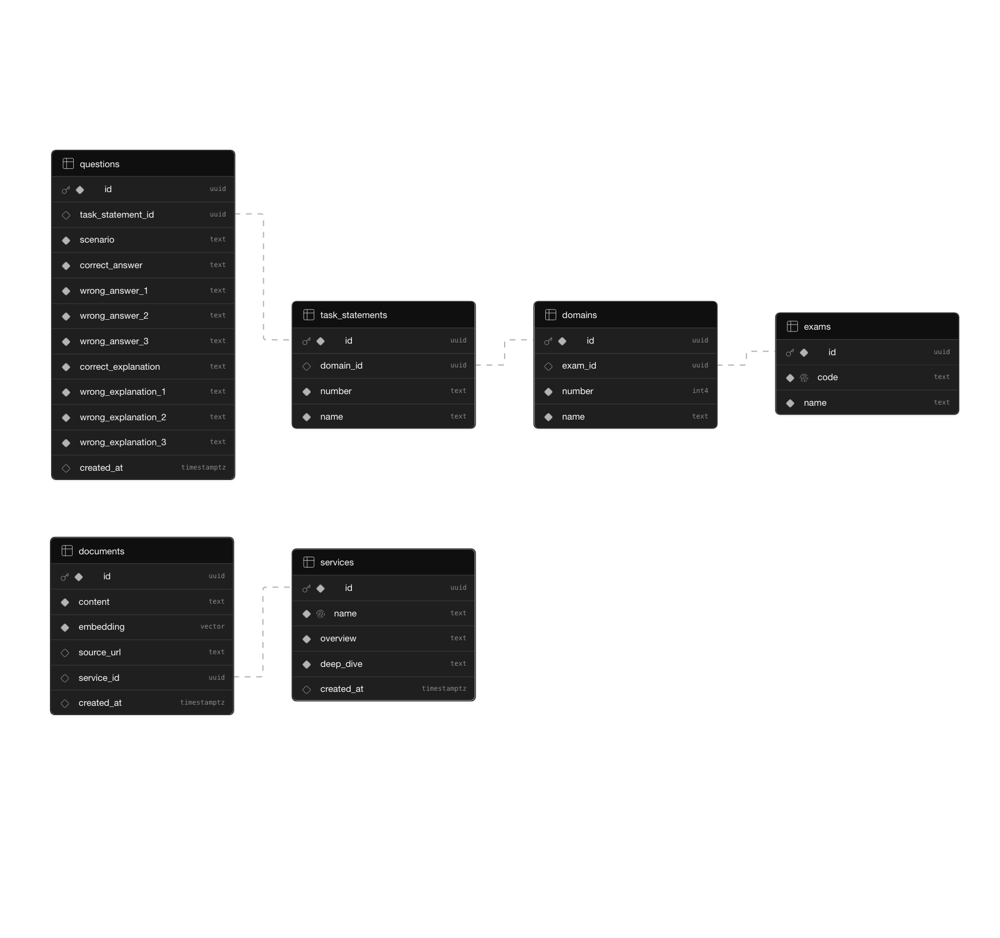

# Journal: Project CloudIQ

_Documents hurdles, inflection points, useful notes, and relevant minutiae._

## Sprint 2: RAG Pipeline

Goal: Establish a working `/api/ask` endpoint.

### [S2-1] AWS Bedrock Client & Identity Verification

**Task**  
Configure local environment to communicate with AWS Bedrock.

**Decision**

Installing the AWS Serverless Application Model (SAM) was recommended for testing scripts and hitting endpoints locally in a "mock" AWS environment, but given the low number of queries I would be making for the next few weeks, I decided to defer this until I would actually be hitting AWS servers with some regularity.

That being said, installing the AWS CLI makes your life easier (although you could go the Cloudshell route or just click around in the Management Console), and the AWS SDK is necessary for making API calls, similar to the OpenAI SDK or Vercel AI SDK.

**Hurdles**

I heard about issues with accessing Anthropic's models on Bedrock, so I submitted a usage report to Anthropic for Claude Haiku 4.5 about a week prior to starting Sprint 1. But what ended up blocking me for almost 2 weeks was Bedrock's default service quotas.

I assumed there'd be no issues since most non-Marketplace models are now technically available on first invocation, but it looks like a combination of high demand for Bedrock inference and new account sandboxing caused my actual service quota to be set to 0. Thankfully the AWS Support Team was pretty helpful in pushing my ticket through the Services Team's queue and getting the sandbox lifted.

It ended up working out because I swapped Sprint 1's original goals with a parallel feature - the Mock Exam UI - but the lesson here is never assume!

<details>

<summary>Notes on installing SDK, setting up IAM access, requesting service quota increases, calling the Bedrock API.</summary>

**Install SDK**

```zsh
npm install @aws-sdk/client-bedrock-runtime
```

[AWS SDK for JavaScript v3](https://github.com/aws/aws-sdk-js-v3) | [Developer Guide](https://docs.aws.amazon.com/AWSJavaScriptSDK/v3/latest/) | [API Reference](https://docs.aws.amazon.com/AWSJavaScriptSDK/v3/latest/introduction/)

**API**

[How to set up environment](https://docs.aws.amazon.com/bedrock/latest/userguide/getting-started-api.html)

[BedrockClient API](https://docs.aws.amazon.com/AWSJavaScriptSDK/v3/latest/client/bedrock/)

**Set up Access**

[IAM](https://docs.aws.amazon.com/bedrock/latest/userguide/security-iam.html)

"""

1. On the AWS Management Console Home page, select the IAM service or navigate to the IAM console at https://console.aws.amazon.com/iam/.

2. Select Users or Roles and then select your user or role.

3. In the Permissions tab, choose Add permissions and then choose Add AWS managed policy. Choose the AmazonBedrockFullAccess AWS managed policy.

4. To allow the user or role to subscribe to models, choose Create inline policy and then specify the following permissions in the JSON editor:
   """

_From [AWS Docs](https://docs.aws.amazon.com/bedrock/latest/userguide/getting-started-api.html#gs-api-br-permissions)_

**Request Quota Increase (Starts at Zero)**

https://docs.aws.amazon.com/bedrock/latest/userguide/quotas.html

https://docs.aws.amazon.com/bedrock/latest/userguide/quotas-increase.html

**Tool Use**

Jan 29, 2026: "Amazon Bedrock now supports server-side tools in the Responses API using OpenAI API-compatible service endpoints. Bedrock already supports client-side tool use with the Converse, Chat Completions, and Responses APIs. Now, with the launch of server-side tool use for Responses API, Amazon Bedrock calls the tools directly without going through a client, enabling your AI applications to perform real-time, multi-step actions such as searching the web, executing code, and updating databases within the organizational, governance, compliance, and security boundaries of your AWS accounts. You can either submit your own custom Lambda function to run custom tools or use AWS-provided tools, such as notes and tasks." - [Ref](https://docs.aws.amazon.com/bedrock/latest/userguide/tool-use.html)

</details>

<details>

<summary>Verifying the connections work.</summary>

**Check if AWS CLI is installed and get version**

```zsh
aws --version

aws-cli/2.34.13 Python/3.14.3 Darwin/24.6.0 exec-env/AmazonQ-For-IDE Version/2.0.0 exe/arm64
```

**Check AWS CLI configuration**

```zsh
aws configure list

NAME : VALUE : TYPE : LOCATION
profile : <not set> : None : None
access_key : 23UV : shared-credentials-file :
secret_key : /gkB : shared-credentials-file :
region : us-east-1 : config-file : ~/.aws/config

```

**Check access to Bedrock API and list Titan models**

```zsh
aws bedrock list-foundation-models --region us-east-1 --by-provider amazon --query 'modelSummaries[?contains(modelId, `titan-embed`) || contains(modelId, `titan-text`)].{ModelId:modelId,Name:modelName}' --output table 2>&1 | head -20
---
| ListFoundationModels |
+----------------------------------+----------------------------------+
| ModelId | Name |
+----------------------------------+----------------------------------+
| amazon.titan-embed-g1-text-02 | Titan Text Embeddings v2 |
| amazon.titan-embed-text-v1:2:8k | Titan Embeddings G1 - Text |
| amazon.titan-embed-text-v1 | Titan Embeddings G1 - Text |
| amazon.titan-embed-text-v2:0:8k | Titan Text Embeddings V2 |
| amazon.titan-embed-text-v2:0 | Titan Text Embeddings V2 |
| amazon.titan-embed-image-v1:0 | Titan Multimodal Embeddings G1 |
| amazon.titan-embed-image-v1 | Titan Multimodal Embeddings G1 |
+----------------------------------+----------------------------------+

```

**Check if Claude Haiku models available**

```zsh
aws bedrock list-foundation-models --region us-east-1 --by-provider anthropic --query 'modelSummaries[?contains(modelId, `haiku`)].{ModelId:modelId,Name:modelName}' --output table
---
| ListFoundationModels |
+----------------------------------------------+--------------------+
| ModelId | Name |
+----------------------------------------------+--------------------+
| anthropic.claude-haiku-4-5-20251001-v1:0 | Claude Haiku 4.5 |
| anthropic.claude-3-haiku-20240307-v1:0:48k | Claude 3 Haiku |
| anthropic.claude-3-haiku-20240307-v1:0:200k | Claude 3 Haiku |
| anthropic.claude-3-haiku-20240307-v1:0 | Claude 3 Haiku |
| anthropic.claude-3-5-haiku-20241022-v1:0 | Claude 3.5 Haiku |
+----------------------------------------------+--------------------+
```

</details>

<br>

> _Note: For a quick sanity check for model access you can always open Playgrounds in Bedrock and try chatting with the models you want to invoke, along with testing access with the region/response mode you need._

### [S2-2] Bedrock Embedding and Chat Endpoints

**Task**

- S2-2A. Create a reusable AWS Bedrock client with error handling to signal comm channels clear and credentials are all good.
- S2-2B. Write a Converse call to Haiku and test it returns an LLM response via console.log using npx in terminal.
- S2-2C. Write a Invoke call to Titan Embedding and test it returns the correct vector object via console.log using npx in terminal.
- S2-2D. Package them into exports and drop into a simple test script for dry run.

**Takeaways**

I initially assumed that all Bedrock Runtime engine [endpoints](https://docs.aws.amazon.com/bedrock/latest/userguide/endpoints.html) have a uniform set of required parameters. However the uniform interface is only true of the `Converse API`. For the older `Invoke API`, where you're essentially sending raw JSON, different [foundation models](https://docs.aws.amazon.com/bedrock/latest/userguide/models-supported.html) can have slightly different param requirements. To that end, consulting the [parameters and response fields](https://docs.aws.amazon.com/bedrock/latest/userguide/model-parameters.html) for various FM's is quite helpful.

_Amazon Titan Text Embeddings v2_

Rolled out in mid 2024, [Titan Text Embeddings v2](https://docs.aws.amazon.com/bedrock/latest/userguide/model-card-amazon-titan-text-embeddings-v2.html) is the most advanced of AWS's embedding models, outperforming Titan G1 at 20% of the cost.

One notable departure from Titan G1 and other text embedding models like OpenAI's, is the dimensionality. Whereas G1 and OpenAI's text embedding models typically use 1536, Titan Text Embeddings v2 uses 1024, 512, or 256.

512 is said to be [99% as accurate](https://aws.amazon.com/blogs/aws/amazon-titan-text-v2-now-available-in-amazon-bedrock-optimized-for-improving-rag/), but I opted for 1536 to maximize accuracy.

_Converse API Endpoint_

Unlike OpenAI's ChatCompletions endpoint, Bedrock's Converse endpoint has a more complex nested structure when passing in messages. It uses an array of content blocks because Bedrock supports multimodal inputs, like:

```ts
content: [
    { text: 'What is in this image?' },
    { image: { format: 'png', source: { bytes: imageData } } },
    { text: 'Please describe it in detail.' },
]
```

So even if you're only passing text inputs, you'll need an array of objects:

```ts
const messages = [
    {
        role: 'user',
        content: [{ text: 'What is Amazon SageMaker? Explain in under 50 words.' }],
    },
]
```

...instead of a string like with OpenAI ChatCompletions:

```ts
const messages = [
    {
        role: 'user',
        content: 'What is Amazon SageMaker? Explain in under 50 words.',
    },
]
```

**Decision**

Bedrock uses two main endpoint families: Mantle and Runtime.

Mantle is the newer engine for OpenAI-compatibility. It's also the one every LLM will recommend because AWS Docs recommends it. Presumably because OpenAI is the most popular inference framework, and Mantle is to OpenAI what the Aurora/RDS marketing push was to Oracle's dominance in DBs. _wink wink_

But since I don't have any legacy OpenAI code to port over, and my goal is to build as much of this on AWS as possible, going with the Runtime engine would be a better choice since it's AWS-native and allows me to learn an inference framework I haven't used before.

The basic breakdown for both is as follows.

_Mantle_

- Distributed inference engine designed specifically for OpenAI-compatible large-scale model serving. Use the OpenAI SDK to call Amazon Bedrock models by simply changing the base_url.
- Primary APIs: `Chat Completions`, `Responses`
- Endpoint Format: `bedrock-mantle.{region}.api.aws`
- Best For: Migrating existing OpenAI-based applications to AWS with minimal code changes or using external tools that expect an OpenAI API format.

_Bedrock_

- The AWS-native, serverless API for invoking models within the AWS ecosystem. Also the default way to use Amazon Bedrock via AWS SDKs or AWS CLI.
- Primary APIs: `InvokeModel`, `Converse`
- Endpoint Format: `bedrock-runtime.{region}.amazonaws.com`
- Best For: Applications built natively on AWS using IAM roles and AWS SDKs, especially those requiring complex features like Guardrails and Agents.

[Ref](https://docs.aws.amazon.com/bedrock/latest/userguide/endpoints.html)

<details>

<summary>S2-2B: What the Converse call to Haiku returns.</summary>

```ts
async function testCall() {
    const command = new ConverseCommand({
        modelId: 'us.anthropic.claude-haiku-4-5-20251001-v1:0',
        messages: [
            {
                role: 'user',
                content: [{ text: 'What is Amazon SageMaker?' }],
            },
        ],
    })

    const responseObj = await client.send(command)
    console.log('Full response obj:', JSON.stringify(responseObj, null, 2))
    console.log('Response obj type:', typeof responseObj)

    const responseText = responseObj.output.message.content[0].text
    console.log('LLM response only:', responseText)
}
```

```zsh
npx tsx app/lib/bedrock.ts
Full response obj: {
  "output": {
    "message": {
      "role": "assistant",
      "content": [
        {
          "text": "# Amazon SageMaker\n\nAmazon SageMaker is a **fully managed machine learning service** provided by AWS that simplifies the process of building, training, and deploying machine learning models at scale.\n\n## Key Features\n\n### 1. **Data Preparation**\n- Built-in data labeling and annotation tools\n- Data preprocessing and feature engineering capabilities\n\n### 2. **Model Training**\n- Pre-built algorithms for common ML tasks\n- Support for custom frameworks (TensorFlow, PyTorch, Scikit-learn, etc.)\n- Distributed training across multiple instances\n- Automatic hyperparameter tuning\n\n### 3. **Model Deployment**\n- One-click model deployment to production\n- Auto-scaling capabilities\n- Real-time and batch inference endpoints\n\n### 4. **Development Tools**\n- **SageMaker Studio**: Integrated development environment (IDE) for ML\n- **Jupyter Notebooks**: Pre-configured notebooks\n- **Autopilot**: Automated ML (AutoML) for quick model creation\n\n### 5. **Additional Capabilities**\n- Model monitoring and drift detection\n- Feature Store for managing ML features\n- Experiment tracking\n- Integration with AWS services (S3, Lambda, etc.)\n\n## Common Use Cases\n\n- Predictive analytics\n- Recommendation engines\n- Image and text classification\n- Time series forecasting\n- Fraud detection\n\n## Benefits\n\n✓ Reduces time to market  \n✓ No infrastructure management required  \n✓ Cost-effective (pay-as-you-go pricing)  \n✓ Highly scalable  \n✓ Integrates seamlessly with AWS ecosystem\n\nSageMaker abstracts away much of the infrastructure complexity, allowing data scientists and developers to focus on building effective ML models."
        }
      ]
    }
  },
  "stopReason": "end_turn",
  "usage": {
    "inputTokens": 15,
    "outputTokens": 395,
    "totalTokens": 410,
    "cacheReadInputTokens": 0,
    "cacheWriteInputTokens": 0
  },
  "metrics": {
    "latencyMs": 3421
  },
  "$metadata": {
    "httpStatusCode": 200,
    "requestId": "23796579-806a-4d52-b29d-8b29ba9a4215",
    "attempts": 1,
    "totalRetryDelay": 0
  }
}
Response obj type: object
LLM response only:  # Amazon SageMaker

Amazon SageMaker is a **fully managed machine learning service** provided by AWS that simplifies the process of building, training, and deploying machine learning models at scale.

## Key Features

### 1. **Data Preparation**

- Built-in data labeling and annotation tools
- Data preprocessing and feature engineering capabilities

### 2. **Model Training**

- Pre-built algorithms for common ML tasks
- Support for custom frameworks (TensorFlow, PyTorch, Scikit-learn, etc.)
- Distributed training across multiple instances
- Automatic hyperparameter tuning

### 3. **Model Deployment**

- One-click model deployment to production
- Auto-scaling capabilities
- Real-time and batch inference endpoints

### 4. **Development Tools**

- **SageMaker Studio**: Integrated development environment (IDE) for ML
- **Jupyter Notebooks**: Pre-configured notebooks
- **Autopilot**: Automated ML (AutoML) for quick model creation

### 5. **Additional Capabilities**

- Model monitoring and drift detection
- Feature Store for managing ML features
- Experiment tracking
- Integration with AWS services (S3, Lambda, etc.)

## Common Use Cases

- Predictive analytics
- Recommendation engines
- Image and text classification
- Time series forecasting
- Fraud detection

## Benefits

✓ Reduces time to market
✓ No infrastructure management required
✓ Cost-effective (pay-as-you-go pricing)
✓ Highly scalable
✓ Integrates seamlessly with AWS ecosystem

SageMaker abstracts away much of the infrastructure complexity, allowing data scientists and developers to focus on building effective ML models.

```

</details>

<details>

<summary>S2-2C: What the Invoke call to Titan v2 returns.</summary>

```ts
async function testEmbed() {
    const command = new InvokeModelCommand({
        modelId: models.embedding,
        contentType: 'application/json',
        accept: 'application/json',
        body: JSON.stringify({
            inputText:
                'Amazon SageMaker is often used as an umbrella term encompassing SageMaker Studio, Notebooks, Jumpstart, Canvas, and many more AWS ML services. It is designed for Data Scientists and advanced customization and integration, distinct from AWS Bedrock, which abstracts away a degree of technical complexity.',
            dimensions: 1536,
            normalize: true,
        }),
    })

    const response = await client.send(command)
    console.log('Full response obj:', JSON.stringify(response, null, 2))
    console.log('Response obj type:', typeof response)

    const responseBody = JSON.parse(new TextDecoder().decode(response.body))
    console.log('Decoded response body:', JSON.stringify(responseBody, null, 2))
    console.log('Embedding length:', responseBody.embedding.length)
}
```

```zsh
Full response obj: {
  "body": {
    "0": 123,
    "1": 34,
    "2": 101,
    "3": 109,
    "4": 98,
    "5": 101,
    ...
    "43380": 34,
    "43381": 58,
    "43382": 54,
    "43383": 48,
    "43384": 125
  },
  "contentType": "application/json",
  "$metadata": {
    "httpStatusCode": 200,
    "requestId": "936fa6f2-d446-4182-afbc-0fa7d7072fc4",
    "attempts": 1,
    "totalRetryDelay": 0
  }
}
Response obj type: object
Decoded response body:  {
  "embedding": [
    -0.028260385617613792,
    0.03717189282178879,
    0.015473923645913601,
    -0.04804736748337746,
    0.019862258806824684,
    ...
    -0.006886443123221397,
    0.05528973415493965,
    -0.039914652705192566,
    -0.034210093319416046,
    -0.028344329446554184
  ],
  "embeddingsByType": {
    "float": [
      -0.028260385617613792,
      0.03717189282178879,
      0.015473923645913601,
      -0.04804736748337746,
      0.019862258806824684,
      ...
      -0.006886443123221397,
      0.05528973415493965,
      -0.039914652705192566,
      -0.034210093319416046,
      -0.028344329446554184
    ]
  },
  "inputTextTokenCount": 60
}
Embedding length:  1024
```

</details>

<details>

<summary>Full Bedrock FM model list.</summary>

_Last updated: Sun Apr 12 14:44:33 +08 2026_

| Provider     | Name                                | ID                                            | Input                      | Output       | Stream | Type                         | Status |
| :----------- | :---------------------------------- | :-------------------------------------------- | :------------------------- | :----------- | :----- | :--------------------------- | :----- |
| AI21 Labs    | Jamba 1.5 Large                     | ai21.jamba-1-5-large-v1:0                     | TEXT                       | TEXT         | True   | ON_DEMAND                    | ACTIVE |
| AI21 Labs    | Jamba 1.5 Mini                      | ai21.jamba-1-5-mini-v1:0                      | TEXT                       | TEXT         | True   | ON_DEMAND                    | ACTIVE |
| Amazon       | Amazon Nova Multimodal Embeddings   | amazon.nova-2-multimodal-embeddings-v1:0      | TEXT, IMAGE, AUDIO, VIDEO  | EMBEDDING    | False  | ON_DEMAND                    | ACTIVE |
| Amazon       | Nova Pro                            | amazon.nova-pro-v1:0                          | TEXT, IMAGE, VIDEO         | TEXT         | True   | ON_DEMAND, INFERENCE_PROFILE | ACTIVE |
| Amazon       | Nova 2 Lite                         | amazon.nova-2-lite-v1:0                       | TEXT, IMAGE, VIDEO         | TEXT         | True   | INFERENCE_PROFILE            | ACTIVE |
| Amazon       | Nova 2 Lite                         | amazon.nova-2-lite-v1:0:256k                  | TEXT, IMAGE, VIDEO         | TEXT         | True   | PROVISIONED                  | ACTIVE |
| Amazon       | Nova 2 Sonic                        | amazon.nova-2-sonic-v1:0                      | SPEECH                     | SPEECH, TEXT | True   | ON_DEMAND                    | ACTIVE |
| Amazon       | Titan Text Large                    | amazon.titan-tg1-large                        | TEXT                       | TEXT         | True   | ON_DEMAND                    | ACTIVE |
| Amazon       | Titan Image Generator G1 v2         | amazon.titan-image-generator-v2:0             | TEXT, IMAGE                | IMAGE        | None   | PROVISIONED, ON_DEMAND       | LEGACY |
| Amazon       | Nova Premier                        | amazon.nova-premier-v1:0:8k                   | TEXT, IMAGE, VIDEO         | TEXT         | True   |                              | LEGACY |
| Amazon       | Nova Premier                        | amazon.nova-premier-v1:0:20k                  | TEXT, IMAGE, VIDEO         | TEXT         | True   |                              | LEGACY |
| Amazon       | Nova Premier                        | amazon.nova-premier-v1:0:1000k                | TEXT, IMAGE, VIDEO         | TEXT         | True   |                              | LEGACY |
| Amazon       | Nova Premier                        | amazon.nova-premier-v1:0:mm                   | TEXT, IMAGE, VIDEO         | TEXT         | True   |                              | LEGACY |
| Amazon       | Nova Premier                        | amazon.nova-premier-v1:0                      | TEXT, IMAGE, VIDEO         | TEXT         | True   | INFERENCE_PROFILE            | LEGACY |
| Amazon       | Nova Pro                            | amazon.nova-pro-v1:0:24k                      | TEXT, IMAGE, VIDEO         | TEXT         | True   | PROVISIONED                  | ACTIVE |
| Amazon       | Nova Pro                            | amazon.nova-pro-v1:0:300k                     | TEXT, IMAGE, VIDEO         | TEXT         | True   | PROVISIONED                  | ACTIVE |
| Amazon       | Nova Lite                           | amazon.nova-lite-v1:0:24k                     | TEXT, IMAGE, VIDEO         | TEXT         | True   | PROVISIONED                  | ACTIVE |
| Amazon       | Nova Lite                           | amazon.nova-lite-v1:0:300k                    | TEXT, IMAGE, VIDEO         | TEXT         | True   | PROVISIONED                  | ACTIVE |
| Amazon       | Nova Lite                           | amazon.nova-lite-v1:0                         | TEXT, IMAGE, VIDEO         | TEXT         | True   | ON_DEMAND, INFERENCE_PROFILE | ACTIVE |
| Amazon       | Nova Canvas                         | amazon.nova-canvas-v1:0                       | TEXT, IMAGE                | IMAGE        | False  | ON_DEMAND, PROVISIONED       | LEGACY |
| Amazon       | Nova Reel                           | amazon.nova-reel-v1:0                         | TEXT, IMAGE                | VIDEO        | False  | ON_DEMAND                    | LEGACY |
| Amazon       | Nova Reel                           | amazon.nova-reel-v1:1                         | TEXT, IMAGE                | VIDEO        | False  | ON_DEMAND                    | LEGACY |
| Amazon       | Nova Micro                          | amazon.nova-micro-v1:0:24k                    | TEXT                       | TEXT         | True   | PROVISIONED                  | ACTIVE |
| Amazon       | Nova Micro                          | amazon.nova-micro-v1:0:128k                   | TEXT                       | TEXT         | True   | PROVISIONED                  | ACTIVE |
| Amazon       | Nova Micro                          | amazon.nova-micro-v1:0                        | TEXT                       | TEXT         | True   | ON_DEMAND, INFERENCE_PROFILE | ACTIVE |
| Amazon       | Nova Sonic                          | amazon.nova-sonic-v1:0                        | SPEECH                     | SPEECH, TEXT | True   | ON_DEMAND                    | LEGACY |
| Amazon       | Titan Text Embeddings v2            | amazon.titan-embed-g1-text-02                 | TEXT                       | EMBEDDING    | None   | ON_DEMAND                    | ACTIVE |
| Amazon       | Titan Embeddings G1 - Text          | amazon.titan-embed-text-v1:2:8k               | TEXT                       | EMBEDDING    | False  | PROVISIONED                  | ACTIVE |
| Amazon       | Titan Embeddings G1 - Text          | amazon.titan-embed-text-v1                    | TEXT                       | EMBEDDING    | False  | ON_DEMAND                    | ACTIVE |
| Amazon       | Titan Text Embeddings V2            | amazon.titan-embed-text-v2:0:8k               | TEXT                       | EMBEDDING    | False  |                              | ACTIVE |
| Amazon       | Titan Text Embeddings V2            | amazon.titan-embed-text-v2:0                  | TEXT                       | EMBEDDING    | False  | ON_DEMAND                    | ACTIVE |
| Amazon       | Titan Multimodal Embeddings G1      | amazon.titan-embed-image-v1:0                 | TEXT, IMAGE                | EMBEDDING    | None   | PROVISIONED                  | ACTIVE |
| Amazon       | Titan Multimodal Embeddings G1      | amazon.titan-embed-image-v1                   | TEXT, IMAGE                | EMBEDDING    | None   | ON_DEMAND                    | ACTIVE |
| Anthropic    | Claude Sonnet 4                     | anthropic.claude-sonnet-4-20250514-v1:0       | TEXT, IMAGE                | TEXT         | True   | INFERENCE_PROFILE            | ACTIVE |
| Anthropic    | Claude Haiku 4.5                    | anthropic.claude-haiku-4-5-20251001-v1:0      | TEXT, IMAGE                | TEXT         | True   | INFERENCE_PROFILE            | ACTIVE |
| Anthropic    | Claude Sonnet 4.6                   | anthropic.claude-sonnet-4-6                   | TEXT, IMAGE                | TEXT         | True   | INFERENCE_PROFILE            | ACTIVE |
| Anthropic    | Claude Opus 4.6                     | anthropic.claude-opus-4-6-v1                  | TEXT, IMAGE                | TEXT         | True   | INFERENCE_PROFILE            | ACTIVE |
| Anthropic    | Claude Sonnet 4.5                   | anthropic.claude-sonnet-4-5-20250929-v1:0     | TEXT, IMAGE                | TEXT         | True   | INFERENCE_PROFILE            | ACTIVE |
| Anthropic    | Claude Opus 4.1                     | anthropic.claude-opus-4-1-20250805-v1:0       | TEXT, IMAGE                | TEXT         | True   | INFERENCE_PROFILE            | ACTIVE |
| Anthropic    | Claude Opus 4.5                     | anthropic.claude-opus-4-5-20251101-v1:0       | TEXT, IMAGE                | TEXT         | True   | INFERENCE_PROFILE            | ACTIVE |
| Anthropic    | Claude 3 Sonnet                     | anthropic.claude-3-sonnet-20240229-v1:0:28k   | TEXT, IMAGE                | TEXT         | True   | PROVISIONED                  | LEGACY |
| Anthropic    | Claude 3 Sonnet                     | anthropic.claude-3-sonnet-20240229-v1:0:200k  | TEXT, IMAGE                | TEXT         | True   | PROVISIONED                  | LEGACY |
| Anthropic    | Claude 3 Sonnet                     | anthropic.claude-3-sonnet-20240229-v1:0       | TEXT, IMAGE                | TEXT         | True   | ON_DEMAND                    | LEGACY |
| Anthropic    | Claude 3 Haiku                      | anthropic.claude-3-haiku-20240307-v1:0:48k    | TEXT, IMAGE                | TEXT         | True   | PROVISIONED                  | LEGACY |
| Anthropic    | Claude 3 Haiku                      | anthropic.claude-3-haiku-20240307-v1:0:200k   | TEXT, IMAGE                | TEXT         | True   | PROVISIONED                  | LEGACY |
| Anthropic    | Claude 3 Haiku                      | anthropic.claude-3-haiku-20240307-v1:0        | TEXT, IMAGE                | TEXT         | True   | ON_DEMAND                    | LEGACY |
| Anthropic    | Claude 3.7 Sonnet                   | anthropic.claude-3-7-sonnet-20250219-v1:0     | TEXT, IMAGE                | TEXT         | True   | INFERENCE_PROFILE            | LEGACY |
| Anthropic    | Claude 3.5 Haiku                    | anthropic.claude-3-5-haiku-20241022-v1:0      | TEXT                       | TEXT         | True   | INFERENCE_PROFILE            | LEGACY |
| Anthropic    | Claude Opus 4                       | anthropic.claude-opus-4-20250514-v1:0         | TEXT, IMAGE                | TEXT         | True   | INFERENCE_PROFILE            | LEGACY |
| Cohere       | Embed v4                            | cohere.embed-v4:0                             | TEXT, IMAGE                | EMBEDDING    | False  | ON_DEMAND, INFERENCE_PROFILE | ACTIVE |
| Cohere       | Command R                           | cohere.command-r-v1:0                         | TEXT                       | TEXT         | True   | ON_DEMAND                    | LEGACY |
| Cohere       | Command R+                          | cohere.command-r-plus-v1:0                    | TEXT                       | TEXT         | True   | ON_DEMAND                    | LEGACY |
| Cohere       | Embed English                       | cohere.embed-english-v3:0:512                 | TEXT                       | EMBEDDING    | False  | PROVISIONED                  | ACTIVE |
| Cohere       | Embed English                       | cohere.embed-english-v3                       | TEXT                       | EMBEDDING    | False  | ON_DEMAND                    | ACTIVE |
| Cohere       | Embed Multilingual                  | cohere.embed-multilingual-v3:0:512            | TEXT                       | EMBEDDING    | False  | PROVISIONED                  | ACTIVE |
| Cohere       | Embed Multilingual                  | cohere.embed-multilingual-v3                  | TEXT                       | EMBEDDING    | False  | ON_DEMAND                    | ACTIVE |
| Cohere       | Rerank 3.5                          | cohere.rerank-v3-5:0                          | TEXT                       | TEXT         | False  | ON_DEMAND                    | ACTIVE |
| DeepSeek     | DeepSeek V3.2                       | deepseek.v3.2                                 | TEXT                       | TEXT         | True   | ON_DEMAND                    | ACTIVE |
| DeepSeek     | DeepSeek-R1                         | deepseek.r1-v1:0                              | TEXT                       | TEXT         | True   | INFERENCE_PROFILE            | ACTIVE |
| Google       | Gemma 3 12B IT                      | google.gemma-3-12b-it                         | TEXT, IMAGE                | TEXT         | True   | ON_DEMAND                    | ACTIVE |
| Google       | Gemma 3 4B IT                       | google.gemma-3-4b-it                          | TEXT, IMAGE                | TEXT         | True   | ON_DEMAND                    | ACTIVE |
| Google       | Gemma 3 27B PT                      | google.gemma-3-27b-it                         | TEXT, IMAGE                | TEXT         | True   | ON_DEMAND                    | ACTIVE |
| Meta         | Llama 3 8B Instruct                 | meta.llama3-8b-instruct-v1:0                  | TEXT                       | TEXT         | True   | ON_DEMAND                    | ACTIVE |
| Meta         | Llama 3 70B Instruct                | meta.llama3-70b-instruct-v1:0                 | TEXT                       | TEXT         | True   | ON_DEMAND                    | ACTIVE |
| Meta         | Llama 3.1 8B Instruct               | meta.llama3-1-8b-instruct-v1:0                | TEXT                       | TEXT         | True   | INFERENCE_PROFILE            | ACTIVE |
| Meta         | Llama 3.1 70B Instruct              | meta.llama3-1-70b-instruct-v1:0               | TEXT                       | TEXT         | True   | INFERENCE_PROFILE            | ACTIVE |
| Meta         | Llama 3.2 11B Instruct              | meta.llama3-2-11b-instruct-v1:0               | TEXT, IMAGE                | TEXT         | True   | INFERENCE_PROFILE            | LEGACY |
| Meta         | Llama 3.2 90B Instruct              | meta.llama3-2-90b-instruct-v1:0               | TEXT, IMAGE                | TEXT         | True   | INFERENCE_PROFILE            | LEGACY |
| Meta         | Llama 3.2 1B Instruct               | meta.llama3-2-1b-instruct-v1:0                | TEXT                       | TEXT         | True   | INFERENCE_PROFILE            | LEGACY |
| Meta         | Llama 3.2 3B Instruct               | meta.llama3-2-3b-instruct-v1:0                | TEXT                       | TEXT         | True   | INFERENCE_PROFILE            | LEGACY |
| Meta         | Llama 3.3 70B Instruct              | meta.llama3-3-70b-instruct-v1:0               | TEXT                       | TEXT         | True   | INFERENCE_PROFILE            | ACTIVE |
| Meta         | Llama 4 Scout 17B Instruct          | meta.llama4-scout-17b-instruct-v1:0           | TEXT, IMAGE                | TEXT         | True   | INFERENCE_PROFILE            | ACTIVE |
| Meta         | Llama 4 Maverick 17B Instruct       | meta.llama4-maverick-17b-instruct-v1:0        | TEXT, IMAGE                | TEXT         | True   | INFERENCE_PROFILE            | ACTIVE |
| MiniMax      | MiniMax M2                          | minimax.minimax-m2                            | TEXT                       | TEXT         | True   | ON_DEMAND                    | ACTIVE |
| MiniMax      | MiniMax M2.5                        | minimax.minimax-m2.5                          | TEXT                       | TEXT         | True   | ON_DEMAND                    | ACTIVE |
| MiniMax      | MiniMax M2.1                        | minimax.minimax-m2.1                          | TEXT                       | TEXT         | True   | ON_DEMAND                    | ACTIVE |
| Mistral AI   | Voxtral Mini 3B 2507                | mistral.voxtral-mini-3b-2507                  | SPEECH, TEXT               | TEXT         | True   | ON_DEMAND                    | ACTIVE |
| Mistral AI   | Mistral Large 3                     | mistral.mistral-large-3-675b-instruct         | TEXT, IMAGE                | TEXT         | True   | ON_DEMAND                    | ACTIVE |
| Mistral AI   | Devstral 2 123B                     | mistral.devstral-2-123b                       | TEXT                       | TEXT         | True   | ON_DEMAND                    | ACTIVE |
| Mistral AI   | Ministral 14B 3.0                   | mistral.ministral-3-14b-instruct              | TEXT, IMAGE                | TEXT         | True   | ON_DEMAND                    | ACTIVE |
| Mistral AI   | Ministral 3 8B                      | mistral.ministral-3-8b-instruct               | TEXT, IMAGE                | TEXT         | True   | ON_DEMAND                    | ACTIVE |
| Mistral AI   | Voxtral Small 24B 2507              | mistral.voxtral-small-24b-2507                | SPEECH, TEXT               | TEXT         | True   | ON_DEMAND                    | ACTIVE |
| Mistral AI   | Magistral Small 2509                | mistral.magistral-small-2509                  | TEXT, IMAGE                | TEXT         | True   | ON_DEMAND                    | ACTIVE |
| Mistral AI   | Ministral 3B                        | mistral.ministral-3-3b-instruct               | TEXT, IMAGE                | TEXT         | True   | ON_DEMAND                    | ACTIVE |
| Mistral AI   | Mistral 7B Instruct                 | mistral.mistral-7b-instruct-v0:2              | TEXT                       | TEXT         | True   | ON_DEMAND                    | ACTIVE |
| Mistral AI   | Mixtral 8x7B Instruct               | mistral.mixtral-8x7b-instruct-v0:1            | TEXT                       | TEXT         | True   | ON_DEMAND                    | ACTIVE |
| Mistral AI   | Mistral Large (24.02)               | mistral.mistral-large-2402-v1:0               | TEXT                       | TEXT         | True   | ON_DEMAND                    | ACTIVE |
| Mistral AI   | Mistral Small (24.02)               | mistral.mistral-small-2402-v1:0               | TEXT                       | TEXT         | True   | ON_DEMAND                    | ACTIVE |
| Mistral AI   | Pixtral Large (25.02)               | mistral.pixtral-large-2502-v1:0               | TEXT, IMAGE                | TEXT         | True   | INFERENCE_PROFILE            | ACTIVE |
| Moonshot AI  | Kimi K2.5                           | moonshotai.kimi-k2.5                          | TEXT, IMAGE                | TEXT         | True   | ON_DEMAND                    | ACTIVE |
| Moonshot AI  | Kimi K2 Thinking                    | moonshot.kimi-k2-thinking                     | TEXT                       | TEXT         | True   | ON_DEMAND                    | ACTIVE |
| NVIDIA       | NVIDIA Nemotron Nano 12B v2 VL BF16 | nvidia.nemotron-nano-12b-v2                   | TEXT, IMAGE                | TEXT         | True   | ON_DEMAND                    | ACTIVE |
| NVIDIA       | Nemotron Nano 3 30B                 | nvidia.nemotron-nano-3-30b                    | TEXT                       | TEXT         | True   | ON_DEMAND                    | ACTIVE |
| NVIDIA       | NVIDIA Nemotron 3 Super 120B A12B   | nvidia.nemotron-super-3-120b                  | TEXT                       | TEXT         | True   | ON_DEMAND                    | ACTIVE |
| NVIDIA       | NVIDIA Nemotron Nano 9B v2          | nvidia.nemotron-nano-9b-v2                    | TEXT                       | TEXT         | True   | ON_DEMAND                    | ACTIVE |
| OpenAI       | gpt-oss-120b                        | openai.gpt-oss-120b-1:0                       | TEXT                       | TEXT         | True   | ON_DEMAND                    | ACTIVE |
| OpenAI       | gpt-oss-20b                         | openai.gpt-oss-20b-1:0                        | TEXT                       | TEXT         | True   | ON_DEMAND                    | ACTIVE |
| OpenAI       | GPT OSS Safeguard 120B              | openai.gpt-oss-safeguard-120b                 | TEXT                       | TEXT         | True   | ON_DEMAND                    | ACTIVE |
| OpenAI       | GPT OSS Safeguard 20B               | openai.gpt-oss-safeguard-20b                  | TEXT                       | TEXT         | True   | ON_DEMAND                    | ACTIVE |
| Qwen         | Qwen3 Coder Next                    | qwen.qwen3-coder-next                         | TEXT                       | TEXT         | True   | ON_DEMAND                    | ACTIVE |
| Qwen         | Qwen3 Next 80B A3B                  | qwen.qwen3-next-80b-a3b                       | TEXT                       | TEXT         | True   | ON_DEMAND                    | ACTIVE |
| Qwen         | Qwen3 32B (dense)                   | qwen.qwen3-32b-v1:0                           | TEXT                       | TEXT         | True   | ON_DEMAND                    | ACTIVE |
| Qwen         | Qwen3 VL 235B A22B                  | qwen.qwen3-vl-235b-a22b                       | TEXT, IMAGE                | TEXT         | True   | ON_DEMAND                    | ACTIVE |
| Qwen         | Qwen3-Coder-30B-A3B-Instruct        | qwen.qwen3-coder-30b-a3b-v1:0                 | TEXT                       | TEXT         | True   | ON_DEMAND                    | ACTIVE |
| Stability AI | Stable Image Creative Upscale       | stability.stable-creative-upscale-v1:0        | TEXT, IMAGE                | IMAGE        | False  | INFERENCE_PROFILE            | ACTIVE |
| Stability AI | Stable Image Remove Background      | stability.stable-image-remove-background-v1:0 | TEXT, IMAGE                | IMAGE        | False  | INFERENCE_PROFILE            | ACTIVE |
| Stability AI | Stable Image Control Sketch         | stability.stable-image-control-sketch-v1:0    | TEXT, IMAGE                | IMAGE        | False  | INFERENCE_PROFILE            | ACTIVE |
| Stability AI | Stable Image Conservative Upscale   | stability.stable-conservative-upscale-v1:0    | TEXT, IMAGE                | IMAGE        | False  | INFERENCE_PROFILE            | ACTIVE |
| Stability AI | Stable Image Search and Recolor     | stability.stable-image-search-recolor-v1:0    | TEXT, IMAGE                | IMAGE        | False  | INFERENCE_PROFILE            | ACTIVE |
| Stability AI | Stable Image Fast Upscale           | stability.stable-fast-upscale-v1:0            | TEXT, IMAGE                | IMAGE        | False  | INFERENCE_PROFILE            | ACTIVE |
| Stability AI | Stable Image Erase Object           | stability.stable-image-erase-object-v1:0      | TEXT, IMAGE                | IMAGE        | False  | INFERENCE_PROFILE            | ACTIVE |
| Stability AI | Stable Image Control Structure      | stability.stable-image-control-structure-v1:0 | TEXT, IMAGE                | IMAGE        | False  | INFERENCE_PROFILE            | ACTIVE |
| Stability AI | Stable Image Outpaint               | stability.stable-outpaint-v1:0                | TEXT, IMAGE                | IMAGE        | False  | INFERENCE_PROFILE            | ACTIVE |
| Stability AI | Stable Image Inpaint                | stability.stable-image-inpaint-v1:0           | TEXT, IMAGE                | IMAGE        | False  | INFERENCE_PROFILE            | ACTIVE |
| Stability AI | Stable Image Style Guide            | stability.stable-image-style-guide-v1:0       | TEXT, IMAGE                | IMAGE        | False  | INFERENCE_PROFILE            | ACTIVE |
| Stability AI | Stable Image Style Transfer         | stability.stable-style-transfer-v1:0          | TEXT, IMAGE                | IMAGE        | False  | INFERENCE_PROFILE            | ACTIVE |
| Stability AI | Stable Image Search and Replace     | stability.stable-image-search-replace-v1:0    | TEXT, IMAGE                | IMAGE        | False  | INFERENCE_PROFILE            | ACTIVE |
| TwelveLabs   | Pegasus v1.2                        | twelvelabs.pegasus-1-2-v1:0                   | TEXT, VIDEO                | TEXT         | True   | INFERENCE_PROFILE, ON_DEMAND | ACTIVE |
| TwelveLabs   | Marengo Embed 3.0                   | twelvelabs.marengo-embed-3-0-v1:0             | TEXT, IMAGE, SPEECH, VIDEO | EMBEDDING    | False  | INFERENCE_PROFILE, ON_DEMAND | ACTIVE |
| TwelveLabs   | Marengo Embed v2.7                  | twelvelabs.marengo-embed-2-7-v1:0             | TEXT, IMAGE, SPEECH, VIDEO | EMBEDDING    | False  | INFERENCE_PROFILE            | ACTIVE |
| Writer       | Palmyra X5                          | writer.palmyra-x5-v1:0                        | TEXT                       | TEXT         | True   | INFERENCE_PROFILE            | ACTIVE |
| Writer       | Palmyra X4                          | writer.palmyra-x4-v1:0                        | TEXT                       | TEXT         | True   | INFERENCE_PROFILE            | ACTIVE |
| Writer       | Writer Palmyra Vision 7B            | writer.palmyra-vision-7b                      | TEXT, IMAGE                | TEXT         | True   | ON_DEMAND                    | ACTIVE |
| Z.AI         | GLM 4.7 Flash                       | zai.glm-4.7-flash                             | TEXT                       | TEXT         | True   | ON_DEMAND                    | ACTIVE |
| Z.AI         | GLM 5                               | zai.glm-5                                     | TEXT                       | TEXT         | True   | ON_DEMAND                    | ACTIVE |
| Z.AI         | GLM 4.7                             | zai.glm-4.7                                   | TEXT                       | TEXT         | True   | ON_DEMAND                    | ACTIVE |

</details>

<details>

<summary>Links for further reading.</summary>

[APIs supported by Amazon Bedrock:](https://docs.aws.amazon.com/bedrock/latest/userguide/apis.html)

- [Invoke API](https://docs.aws.amazon.com/bedrock/latest/userguide/inference-invoke.html)
- [Converse API](https://docs.aws.amazon.com/bedrock/latest/userguide/conversation-inference.html)
- [Responses API](https://docs.aws.amazon.com/bedrock/latest/userguide/bedrock-mantle.html#bedrock-mantle-responses) / [OpenAI Docs](https://platform.openai.com/docs/api-reference/responses)
- [Chat Completions API](https://docs.aws.amazon.com/bedrock/latest/userguide/inference-chat-completions.html)

[Supported foundation models in Amazon Bedrock:](https://docs.aws.amazon.com/bedrock/latest/userguide/models-supported.html)

- [List Available Models API](https://docs.aws.amazon.com/bedrock/latest/userguide/bedrock-mantle.html#bedrock-mantle-models)

[Inference:](https://docs.aws.amazon.com/bedrock/latest/userguide/inference.html)

- [Learn about use cases for different model inference methods](https://docs.aws.amazon.com/bedrock/latest/userguide/inference-methods.html)
- [How inference works in Amazon Bedrock](https://docs.aws.amazon.com/bedrock/latest/userguide/inference-how.html)
- [Influence response generation with inference parameters](https://docs.aws.amazon.com/bedrock/latest/userguide/inference-parameters.html)
- [Supported Regions and models for running model inference](https://docs.aws.amazon.com/bedrock/latest/userguide/inference-supported.html)
- [Prerequisites for running model inference](https://docs.aws.amazon.com/bedrock/latest/userguide/inference-prereq.html)
- [Generate responses in the console using playgrounds](https://docs.aws.amazon.com/bedrock/latest/userguide/playgrounds.html)
- [Enhance model responses with model reasoning](https://docs.aws.amazon.com/bedrock/latest/userguide/inference-reasoning.html)
- [Optimize model inference for latency](https://docs.aws.amazon.com/bedrock/latest/userguide/latency-optimized-inference.html)
- [Generate responses using OpenAI APIs](https://docs.aws.amazon.com/bedrock/latest/userguide/bedrock-mantle.html)
- [Submit prompts and generate responses using the API](https://docs.aws.amazon.com/bedrock/latest/userguide/inference-api.html)
- [Get validated JSON results from models](https://docs.aws.amazon.com/bedrock/latest/userguide/structured-output.html)
- [Use a computer use tool to complete an Amazon Bedrock model response](https://docs.aws.amazon.com/bedrock/latest/userguide/computer-use.html)

</details>

<br>

### [S2-3] Create Supabase Vector Table

_You can find virtually everything you need to know for the Supabase vector table setup [here](https://supabase.com/docs/guides/ai/vector-columns)._

_To dive deeper on indexing specifically, see [this](https://github.com/pgvector/pgvector#indexing)._

**Distance Metrics: Cosine, Euclidean, Inner Product**

pgvector support 3 distance metrics:

- Cosine Similarity | operator: `<=>` | op class: `vector_cosine_ops`
- Euclidean Distance (L2) | operator: `<->` | op class: `vector_l2_ops`
- Inner Product | operator: `<#>` | op class: `vector_ip_ops`

Why cosine similarity?

- Titan Embeddings v2 uses normalize: true (unit vectors).
- Industry standard for semantic search.

**Index Types: HNSW vs IVFFlat**

pgvector supports 2 ANN (approximate nearest neighbor) index types:

- [HNSW](https://supabase.com/docs/guides/ai/vector-indexes/hnsw-indexes) (Hierarchical Navigable Small World) | Graph-based | Faster queries
- [IVFFlat](https://supabase.com/docs/guides/ai/vector-indexes/ivf-indexes) (Inverted File with Flat compression) | Clustering-based | Faster to build

_Note: Do not confuse HNSW with NSFW, that's an entirely different index search._

Why HNSW for RAG?

- Works well out-of-the-box with no tuning
- I'm expecting thousands of documents, not millions
- Query speed is more important to me than build time

**Vector Dimensions**

Must match what's returned by the embedding function:

- My `getEmbedding()` function invokes Titan Text Embeddings v2 with a dimension parameter of 1024
- As such, the dimension value for pgvector must be set to `vector(1024)`

**Supabase pgvector**

Extensions must be [explicitly enabled](https://supabase.com/docs/guides/ai/vector-columns#enable-the-extension) per database (extensions are database-scoped). This can be done in two ways:

- Programmatically using SQL query `CREATE EXTENSION IF NOT EXISTS vector;`
- Via the Supabase Extension Management - Dashboard > Database > Extensions > search "vector" > click "Enable"

You can verify it's enabled by running this in the [SQL Editor](https://supabase.com/docs/guides/database/overview#the-sql-editor):

```sql
SELECT * FROM pg_extension WHERE extname = 'vector';
SELECT '[1,2,3]'::vector(3);
```

If successful, the first statement (extension check) returns something like:

```json
[
    {
        "oid": 26575,
        "extname": "vector",
        "extowner": 10,
        "extnamespace": 16392,
        "extrelocatable": true,
        "extversion": "0.8.0",
        "extconfig": null,
        "extcondition": null
    }
]
```

The second (vector type test) should return:

```json
[
    {
        "vector": "[1,2,3]"
    }
]
```

**Schema Design**

Now that the `vector` data type has been made available, the vector table can be created. The [Supabase example](https://supabase.com/docs/guides/ai/vector-columns#create-a-table-to-store-vectors) is intentionally barebones, but I needed a couple more columns.

1. `service_id`

- I expect a majority of user questions to be clarifying features and patterns for specific AWS Services, rather than based on role or task.
- This would allow me to filter `match_documents` queries to only search chunks from the relevant service

2. `source_url`

- AWS Docs are neatly packaged into PDFs by service name, so this seems like a natural partition to filter on.
- AWS Services aren't always neatly siloed, which means descriptions for one service can appear in various forms across multiple types of documentation. As such, being able to select the most appropriate version is vital.

3. `created_at`

- The point of building this RAG pipeline is to keep context fresh, and AWS has been making a lot of changes to shift, regroup, or rebrand services, especially in the AI/ML domain. This would allow me to perform selective batch updates.

**Creating the Table**

```sql
CREATE TABLE documents (
    id UUID PRIMARY KEY DEFAULT gen_random_uuid(),
    content TEXT NOT NULL,
    embedding vector(1024) NOT NULL,
    source_url TEXT,
    service_id UUID REFERENCES services(id),
    created_at TIMESTAMPTZ DEFAULT NOW()
);
```

<details>

<summary>Schema now looks like:</summary>



</details>

<br>

**Create HNSW Index**

The HNSW indexing algorithm should be leveraged to significantly speed up queries. Since it's graph-based, you can narrow the scope before running the search, kind of like how partition filtering and pushdown predicates work to reduce data movement and in-mem processing prior running the computationally-expensive analysis.

The canonical way to do so according to [Supabase docs](https://supabase.com/docs/guides/ai/vector-indexes/hnsw-indexes#cosine-distance--vectorcosineops-) is:

```sql
create index on items using hnsw (column_name vector_cosine_ops);
```

You can further specify the `m` and `ef_construction` parameters, which tweak recall (more memory used) and accuracy (slower build time), but I think you would really need to know what you're doing here to justify changing the defaults.

```sql
CREATE INDEX ON documents USING hnsw (embedding vector_cosine_ops)
WITH (m = 16, ef_construction = 64);
```

Note that `m = 16` and `ef_construction = 64` are the values it will default to, so you could omit the second statement entirely and achieve the same result.

**Verify HNSW Index Creation**

After running the index creation command, you can confirm the index exists by running:

```sql
SELECT indexname, indexdef FROM pg_indexes WHERE tablename = 'documents';
```

You should see a response matching the distance metric (`vector_cosine_ops`), table name (`documents`), and vector column name (`embedding`) you defined in your `CREATE INDEX` statement:

```json
[
    {
        "indexname": "documents_pkey",
        "indexdef": "CREATE UNIQUE INDEX documents_pkey ON public.documents USING btree (id)"
    },
    {
        "indexname": "documents_embedding_idx",
        "indexdef": "CREATE INDEX documents_embedding_idx ON public.documents USING hnsw (embedding vector_cosine_ops) WITH (m='16', ef_construction='64')"
    }
]
```

**Test Similarity Search Query**

Before running off to complete the `supabase.rpc()` function so you can query your vector table from within the application code, it's a good idea to run a one-off test using dummy data:

```sql
SELECT id, content, 1 - (embedding <=> array_fill(0.0, ARRAY[1024])::vector(1024)) AS similarity
FROM documents
ORDER BY embedding <=> array_fill(0.0, ARRAY[1024])::vector(1024)
LIMIT 5;
```

It should return `Success. No rows returned`, but make sure to click the 'Explain' tab in SQL Editor and confirm the query used `Index Scan` and not `Seq Scan`, the latter of which means that a full sequential scan was run, and your index was ignored.

Expected behavior:

```md
Limit (cost=4.41..4.62 rows=5 width=64) (actual time=0.035..0.036 rows=0 loops=1)
-> Index Scan using documents_embedding_idx on documents (cost=4.41..25.45 rows=490 width=64) (actual time=0.034..0.035 rows=0 loops=1)
...
```

**Create RPC Function**

I'll let Supabase explain this one:

> _Supabase client libraries like supabase-js connect to your Postgres instance via PostgREST. PostgREST does not currently support pgvector similarity operators, so we'll need to wrap our query in a Postgres function and call it via the rpc() method:_

```sql
create or replace function match_documents (
  query_embedding extensions.vector(384),
  match_threshold float,
  match_count int
)
returns table (
  id bigint,
  title text,
  body text,
  similarity float
)
language sql stable
as $$
  select
    documents.id,
    documents.title,
    documents.body,
    1 - (documents.embedding <=> query_embedding) as similarity
  from documents
  where 1 - (documents.embedding <=> query_embedding) > match_threshold
  order by (documents.embedding <=> query_embedding) asc
  limit match_count;
$$;
```

> _To execute the function from your client library, call rpc() with the name of your Postgres function:_

```js
const { data: documents } = await supabaseClient.rpc('match_documents', {
    query_embedding: embedding, // Pass the embedding you want to compare
    match_threshold: 0.78, // Choose an appropriate threshold for your data
    match_count: 10, // Choose the number of matches
})
```

[Source](https://supabase.com/docs/guides/ai/vector-columns#querying-a-vector--embedding)

Note: Make sure to run the `match_documents` SQL function in the Supabase SQL Editor so that it exists in your database. Otherwise your RPC function has nothing to call.

If no error the result should be `Success. No rows returned`.

You can check that the function exists by following this path `Dashboard > Database > Functions`.

If you click the ellipses on the function card, you can navigate to `Client API docs`, which will give you the exact code you need to call the function.

In my case:

<!-- prettier-ignore -->
```js
let { data, error } = await supabase
  .rpc('match_documents', {
    match_count, 
    match_threshold, 
    query_embedding
  })
if (error) console.error(error)
else console.log(data)
```

### [S2-3] Extraction Pipeline: PDF -> Markdown -> Langchain

This step took much longer than anticipated. Having never really thought about how PDFs work, I was surprised to learn how hard it is to reliably extract data from them.

**Hurdles: Heading Detection**

I initially chose Docling for its 'structural fidelity'. Because of this, I was surprised to find that Docling struggles with something as seemingly basic as recognizing heading hiearchy. This is a whole other can of worms to do with the PDF binary to text conversion and inconsistency of tag usage. Basically, there are as many different ways to set up a PDF as there are people who make them.

For Docling specifically, the issue lies in the conversion from it's internal intermediary object (type: `<class 'docling.datamodel.document.ConversionResult'>`). This is a known issue to the IBM maintainers, and based on the heated exchanges on this long-running [issue thread](https://github.com/docling-project/docling/issues/529?issue=docling-project%7Cdocling%7C287) in Docling's [GitHub repo](https://github.com/docling-project/docling), a frustration shared by many.

For my use case specifically, I found that Docling was unable to pick up on the `section_headers` for AWS Docs PDFs. This was true for small Exam Guide PDFs as well as large multi-hundred page Service Guides.

When I inspected the intermediate result object:

```py
for item in raw_text.document.texts:
    if getattr(item, "label", None) == "section_header":
        print(f"Level: {getattr(item, 'level', 'N/A')} | Text: {item.text[:60]}")
```

I found that it was returning the same level for all section headers:

```zsh
Level: 1 | Text: Scenario 1 - Connect to instances without VPC BPA turned on
Level: 1 | Text: 1.1 Connect to instances
Level: 1 | Text: AWS Management Console
Level: 1 | Text: AWS CLI
Level: 1 | Text: Scenario 2 - Turn on VPC BPA in Bidirectional mode
Level: 1 | Text: 2.1 Enable VPC BPA bidirectional mode
Level: 1 | Text: AWS Management Console
Level: 1 | Text: AWS CLI
```

I tried the most promising fix, a 'post-processing' [package](https://github.com/krrome/docling-hierarchical-pdf) created by [a community member](https://github.com/krrome). It successfully picked up a second level on a 20-page exam guide, but crashed a few minutes into a 700-page PDF. I later found out that it works by iterating through every item in the Table of Contents and trying to match it to extracted content using bounding box coordinates.

The TOC on that 700-page PDF had over 300 items. You do the match.

And 700 pages is small potatoes for AWS Docs. This approach would never work for the AWS S3 or AWS Glue user guide.

_Other tools to try:_ [Kreuzberg](https://github.com/opendatalab/PDF-Extract-Kit), [langextract](https://github.com/google/langextract), [PDF Extract Kit](https://github.com/opendatalab/PDF-Extract-Kit)

**Decision: Plain Text vs Markdown**

Markdown.

Something I'd never considered, since most of the AI Engineering / RAG tutorials I've come across focus on parsing and storing plain text. Some include a `title` column in the vector table, but that's about it.

It wasn't until I stumbled across [this article](https://onlyoneaman.medium.com/i-tested-7-python-pdf-extractors-so-you-dont-have-to-2025-edition-c88013922257), that I found out you can (and should) preserve the data hierarchy in order to create more meaningful semantic relationships between documents in your vector db.

The author explains this much more eloquently:

> _"...parsers are able to generate a markdown representation of the content. This is important for RAG because a lot of contextual information is communicated in things like headings, images, graphs, and formatting. We want to preserve this information so the LLM can better determine how to “think” about the information provided in a given piece of content."_ - [Aman Kumar](https://github.com/onlyoneaman)

This shift from plain text to markdown is particularly relevant to this project because AWS documentation communicates critical relationships through hierarchy. A "Service Limit" for S3 is contextually distinct from one for EC2 only if the parent headers are preserved.

Critically, markdown allows for:

- Semantic Splitting: Using `MarkdownHeaderTextSplitter` to break chunks at logical section boundaries.
- Context Inheritance: Prepending header "breadcrumbs" like `S3 > Security > Encryption` to the text before embedding

**Decision: Docling vs Marker**

I didn't end up going with the tools mentioned in that article however. Primarily becuase I didn't want to shell out for another API when I'm already juggling so many of them, alongside monthly donations to charitable causes like OpenAI and Anthropic.

That left me with open source tools like [Docling](https://github.com/docling-project/docling) and [Marker](https://github.com/datalab-to/marker).

Both of these are AI-powered, and Marker was considered for its speed and vision-based approach, which is good for clean, prose-heavy documents. AWS Documentation however, can sometimes get quite messy.

Docling focuses on providing 'structural fidelity', meaning it would handle AWS’s technical tables and "Note/Warning" callouts with higher precision. For a portfolio piece where accuracy in technical Q&A is differentiator, Docling’s layout-aware engine outweighed Marker’s speed advantage.

**Docling Setup**

Pretty straightforward, although the installation takes a _very_ long time due to the ML models it uses under the hood for layout analysis and enhanced recognition.

```zsh
# isolate Python environment
python3 -m venv .venv
source .venv/bin/activate

# install Docling
echo "docling" > requirements.txt
pip install -r requirements.txt

# verify installation
echo "import docling" > scripts/extract_docs.py
echo "print('Success')" >> scripts/extract_docs.py
python3 scripts/extract_docs.py
```

**PDF Extraction Script**

For this workflow, there's really only 3 lines you need from the Docling API:

```python
from docling.document_converter import DocumentConverter

converter = DocumentConverter()
result = converter.convert("path/to/document.pdf")
markdown = result.document.export_to_markdown()
```

Instantiating `DocumentConverter` downloads layout analysis ML models and saves model weights to memory. Subsequent calls to the `.convert()` method will be substantially faster than the first.

Because Docling extracts the PDF contents into its own internal rich object format, the `export_to_X` method is needed to produce a useable file.

My project calls for Markdown, but Docling also supports [several other output formats](https://docling-project.github.io/docling/usage/supported_formats/#supported-output-formats), including HTML, JSON, and YAML.

**Add `metadata` to Vector Table**

In order to enumerate this data hierarchy, the vector table I created earlier needed a `metada` column. This retroactive addition can be made with:

```sql
ALTER TABLE documents ADD COLUMN metadata JSONB;
```

<br>

<details>

<summary>Updated `documents` table schema</summary>

```sql
create table public.documents (
  id uuid not null default gen_random_uuid (),
  content text not null,
  embedding extensions.vector not null,
  source_url text null,
  service_id uuid null,
  created_at timestamp with time zone null default now(),
  metadata jsonb null,
  constraint documents_pkey primary key (id),
  constraint documents_service_id_fkey foreign KEY (service_id) references services (id)
) TABLESPACE pg_default;

create index IF not exists documents_embedding_idx on public.documents using hnsw (embedding extensions.vector_cosine_ops)
with
  (m = '16', ef_construction = '64') TABLESPACE pg_default;
```

</details>

<br>

**Update RPC Function**

Since the LLM needs to see the metadata along with the text chunks, the RPC function also needs to be updated. Because Postgres does not allow the `CREATE OR REPLACE` command to update functions with different signature and return type, the old function needs to be dropped before updating.

<br>

<details>

<summary>Run this in SQL Editor</summary>

```sql
DROP FUNCTION match_documents(vector, double precision, integer);

CREATE OR REPLACE FUNCTION match_documents(
    query_embedding  vector(1024),
    match_threshold  float,
    match_count      int
)
RETURNS TABLE (
    id          uuid,
    content     text,
    source_url  text,
    service_id  uuid,
    metadata    jsonb,
    similarity  float
)
LANGUAGE sql STABLE AS $$
    SELECT id, content, source_url, service_id, metadata,
           1 - (embedding <=> query_embedding) AS similarity
    FROM documents
    WHERE 1 - (embedding <=> query_embedding) > match_threshold
    ORDER BY embedding <=> query_embedding
    LIMIT match_count;
$$;
```

</details>

<br>
