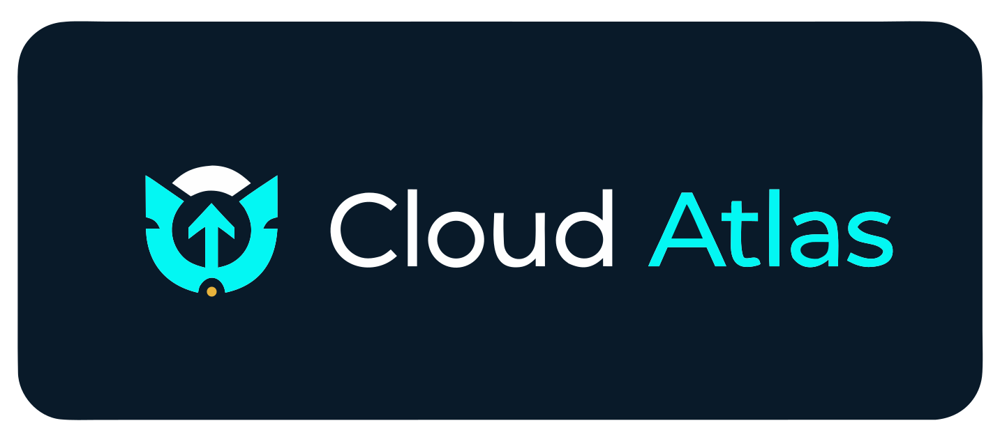

 

<h3>Grounded AI for Certification Prep</h3>

<strong>Live app:</strong> <a href="https://atlas.praevisiolabs.com/">atlas.praevisiolabs.com</a>

<em>by <a href="https://github.com/Praevisio-Labs">Praevisio Labs</a></em>

 

Preparing for an AWS certification means hours of digging through thousands of pages of AWS documentation. Cloud Atlas keeps that work close to the source: you ask a question in plain language, and the answer comes back with the exact doc passages it drew from, so you can verify it rather than take it on faith. Around that sit the practice tools — mock exams, flashcards, and quick concept quizzes — each aligned to how the real exams are organized.

### What Atlas does

- **Docs Agent** — Ask AWS questions in natural language and get answers retrieved from a pgvector store of AWS documentation, cited inline so every claim traces back to a source you can open.
- **Mock Exams** — Full-length, timed practice in an interface modeled on the real test. Each question reveals a written explanation, and a live agent can walk through why every option is right or wrong and stay in the conversation for follow-ups.
- **Flashcards & Speedrun** — Recall drills and quick single-concept questions for the gaps between longer sessions, mapped to each exam's blueprint. 
- **Progress Dashboard** — Per-domain breakdowns of how your practice is going.

### Stack

Next.js 16 · React 19 · TypeScript · Tailwind CSS 4 · Supabase (Postgres + pgvector) · AWS Bedrock (Titan Embeddings v2, Claude Haiku) · LangChain · Vercel AI SDK

### Want to contribute?

If you want to give back to the project, you can add to the curriculum, open a new feature request, or email us with questions and feedback.

[Contribute](https://github.com/myopicOracle/cloud-atlas/issues) · [Email us](mailto:gary@praevisiolabs.com)

 

